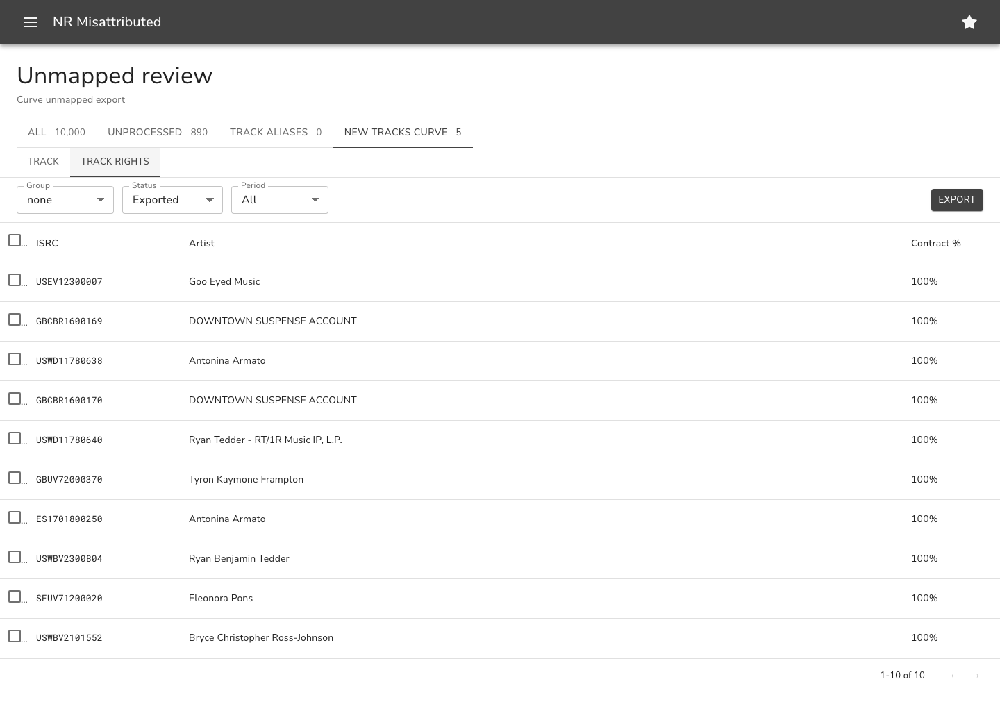
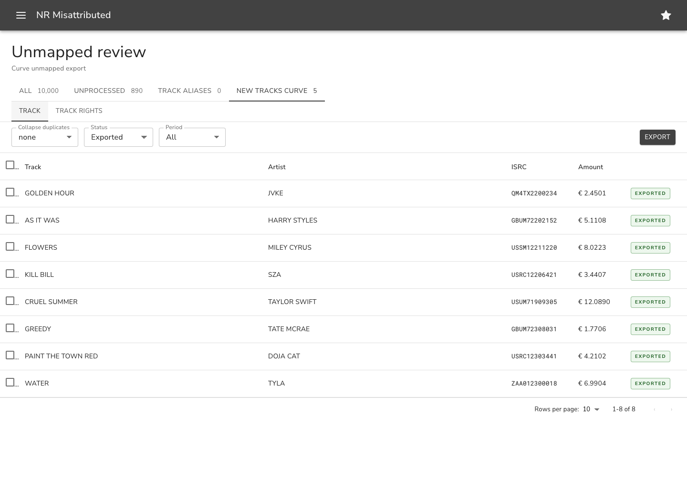
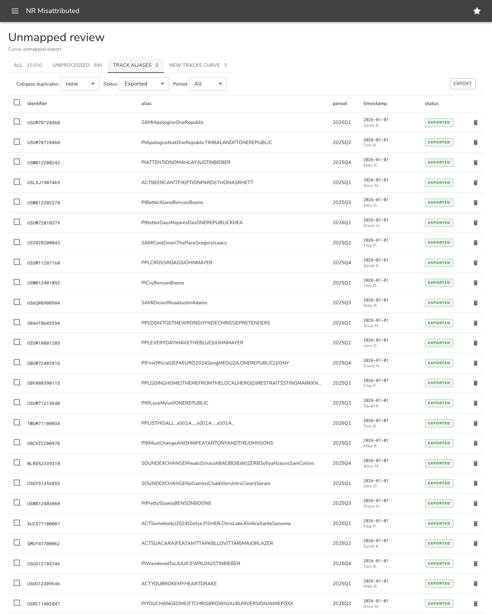
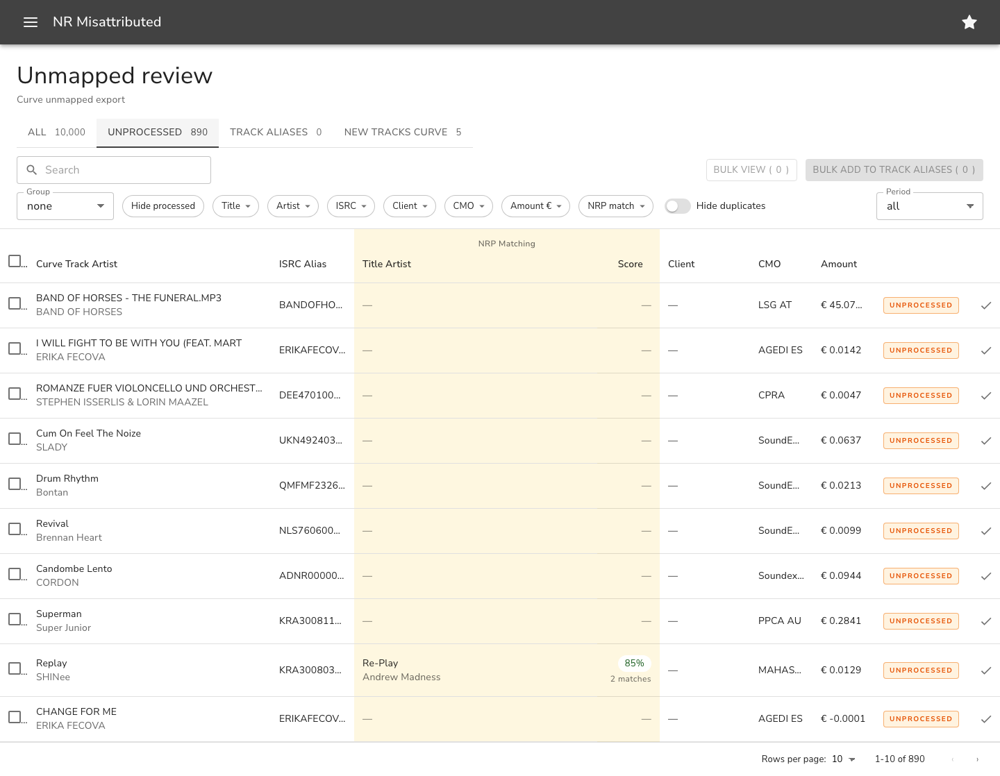
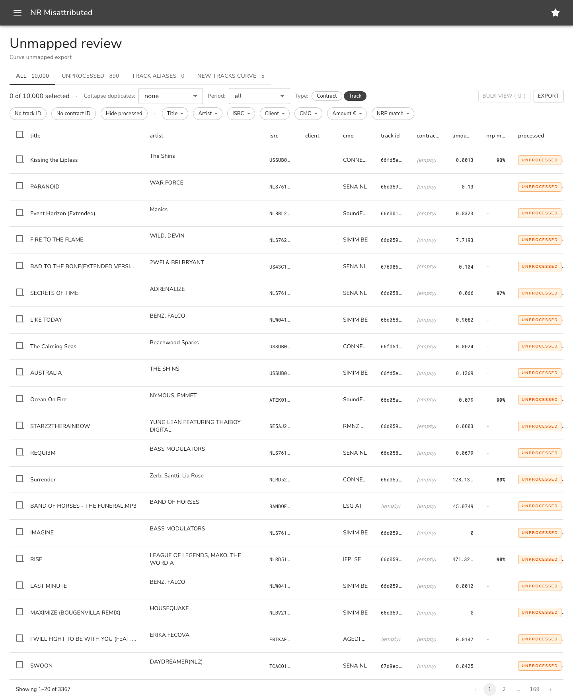

# Design archive

_Reverse-chronological history of significant design moments. Generated by `scripts/update-index.mjs`. Run `pnpm snap <slug> "
"` to add an entry._

**6** entries.

## 2026-05-22 — new-tracks-curve-rights

> New tracks Curve · TRACK RIGHTS sub-tab — 4-col table (checkbox · ISRC · Artist · Contract %), Group/Status/Period filters

branch: `feat/mui-restyle-unprocessed-tab` · commit: `57a80d1` · captured: `2026-05-22T15:41:14.889Z`

Captures: [desktop-1440](./2026-05-22_new-tracks-curve-rights/desktop-1440.png) · [tablet-768](./2026-05-22_new-tracks-curve-rights/tablet-768.png) · [mobile-375](./2026-05-22_new-tracks-curve-rights/mobile-375.png)

---

## 2026-05-22 — new-tracks-curve-track

> New tracks Curve · TRACK sub-tab — 6-col table (checkbox · Track · Artist · ISRC · Amount · status chip), Collapse/Status/Period filters

branch: `feat/mui-restyle-unprocessed-tab` · commit: `57a80d1` · captured: `2026-05-22T15:41:12.658Z`

Captures: [desktop-1440](./2026-05-22_new-tracks-curve-track/desktop-1440.png) · [tablet-768](./2026-05-22_new-tracks-curve-track/tablet-768.png) · [mobile-375](./2026-05-22_new-tracks-curve-track/mobile-375.png)

---

## 2026-05-22 — track-aliases-redesign

> Track Aliases — status/period filters, EXPORTED chip column, timestamp+user 2-line cell, row delete icon, master + per-row checkboxes

branch: `feat/mui-restyle-unprocessed-tab` · commit: `57a80d1` · captured: `2026-05-22T15:41:02.895Z`

Captures: [desktop-1440](./2026-05-22_track-aliases-redesign/desktop-1440.png) · [tablet-768](./2026-05-22_track-aliases-redesign/tablet-768.png) · [mobile-375](./2026-05-22_track-aliases-redesign/mobile-375.png)

---

## 2026-05-22 — unprocessed-track-only

> Unprocessed tab — Track-only + no Track ID locked, hide-duplicates switch, Bulk add to track aliases button

branch: `feat/mui-restyle-unprocessed-tab` · commit: `57a80d1` · captured: `2026-05-22T15:40:53.814Z`

Captures: [desktop-1440](./2026-05-22_unprocessed-track-only/desktop-1440.png) · [tablet-768](./2026-05-22_unprocessed-track-only/tablet-768.png) · [mobile-375](./2026-05-22_unprocessed-track-only/mobile-375.png)

---

## 2026-05-22 — all-tab-mui-restyle

> All tab — MUI v6 restyle landed; AppBar, status chips per row, ArrowDropDown filter chips, MUI tabs

branch: `feat/mui-restyle-unprocessed-tab` · commit: `57a80d1` · captured: `2026-05-22T15:40:43.657Z`

Captures: [desktop-1440](./2026-05-22_all-tab-mui-restyle/desktop-1440.png) · [tablet-768](./2026-05-22_all-tab-mui-restyle/tablet-768.png) · [mobile-375](./2026-05-22_all-tab-mui-restyle/mobile-375.png)

---

## 2026-05-21 — setup-baseline

> Initial visual-regression setup — two-card focus panel + per-row Add-to-Aliases

branch: `chore/visual-regression-setup` · commit: `63e8084` · captured: `2026-05-21T12:05:21.077Z`

Captures: [desktop-1440](./2026-05-21_setup-baseline/desktop-1440.png) · [tablet-768](./2026-05-21_setup-baseline/tablet-768.png) · [mobile-375](./2026-05-21_setup-baseline/mobile-375.png)

---
