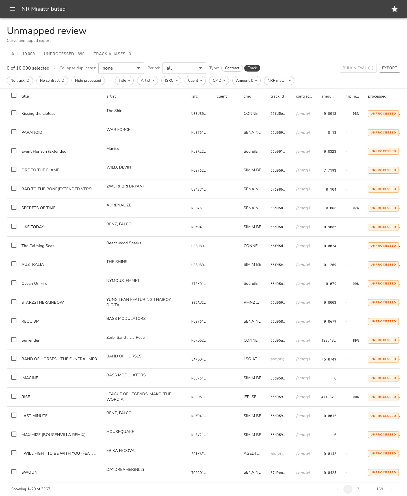

# Design archive

_Reverse-chronological history of significant design moments. Generated by `scripts/update-index.mjs`. Run `pnpm snap <slug> "
"` to add an entry._

**1** entry.

## 2026-05-21 — setup-baseline

> Initial visual-regression setup — two-card focus panel + per-row Add-to-Aliases

branch: `chore/visual-regression-setup` · commit: `63e8084` · captured: `2026-05-21T12:05:21.077Z`

Captures: [desktop-1440](./2026-05-21_setup-baseline/desktop-1440.png) · [tablet-768](./2026-05-21_setup-baseline/tablet-768.png) · [mobile-375](./2026-05-21_setup-baseline/mobile-375.png)

---
